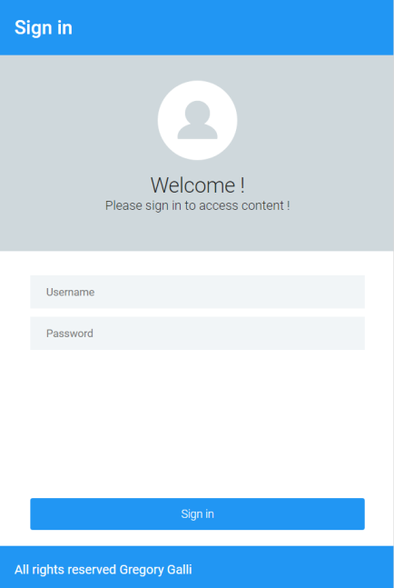
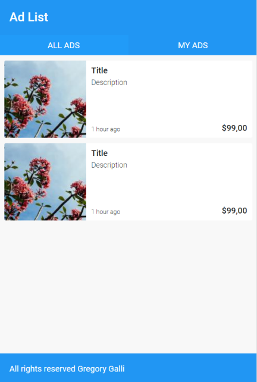

# Projet Web n°1
---
### Objectifs
- Construire deux pages statiques :
    - Page de login 
    - Page de listing d’annonces
- Proposer une version Desktop de la page de listing d’annonces
    - En utilisant les principes du responsive design
- Utiliser les "Grid Layout" pour la structure principale
- Utiliser les "Flexible Layout" pour le reste

### Maquettes
  
  

### Le HTML
la page de login se trouve [ici](login.html)  
la page de listing d'annonces se trouve [ici](adList.html)  